# G1 Humanoid Pick-and-Place via Fine-Tuned Vision-Language-Action Policy

Fine-tune **Isaac GR00T N1.7** on real Unitree G1 robot data to make the G1 respond to the command *"Pick up the red cube and place it in the yellow target region"* in MuJoCo simulation, mapping camera images + language to direct joint position control.

---

## Demo

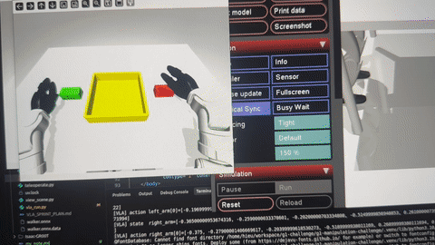

> [Watch full video (MP4)](./assets/videos/demo.mp4)

---

## Results

### 6-Trial Evaluation (Retrained with Timestamp Fix)

Command used in all trials: `"pick up the red cube and place it in the yellow box"`

Cube z = 0.850, box z = 0.84 across all trials. Object and box positions varied to test different spatial scenarios.

| Trial | Cube (x, y) | Box (x, y) | Reach | Grasp | Lift | Transport | Place |
|-------|:-----------:|:----------:|:-----:|:-----:|:----:|:---------:|:-----:|
| 1 | (−0.20, −0.18) | (−0.22, 0.00) | ✅ | ❌ | ❌ | ❌ | ❌ |
| 2 | (−0.16, −0.18) | (−0.22, 0.00) | ✅ | ✅ | ✅ | ✅ | ✅ |
| 3 | (−0.20, −0.05) | (−0.22, 0.10) | ✅ | ✅ | ✅ | ✅ | ✅ |
| 4 | (−0.16, −0.05) | (−0.22, 0.10) | ✅ | ✅ | ✅ | ✅ | ✅ |
| 5 | (−0.25, −0.05) | (−0.22, 0.10) | ✅ | ❌ | ❌ | ❌ | ❌ |
| 6 | (−0.16, +0.18) | (−0.22, 0.00) | ✅ | ❌ | ❌ | ❌ | ❌ |

**Reach: 6/6 — Full task: 3/6**

Failure analysis:
- **Trial 1** — The hand approached the cube but did not close tightly enough. Without wrist cameras the model has no fine-grained visual feedback for the last few centimeters of approach — the grasp fails silently.
- **Trial 5** — Cube at x = −0.25 is outside the arm's comfortable reach range in the training distribution. The robot attempted to extend but could not close the distance — possibly because the dataset has few center-region pickup examples: the yellow box is usually placed near the center, so the model rarely sees demonstrations that pick an object from that area.
- **Trial 6** — Cube at y = +0.18 (left side of table). The model always leads with the right hand — reflecting the dataset bias (all 210 demonstrations are right-hand-first) — and does not switch to the left hand for a left-side target.

### Trial Recordings

<table align="center">
  <tr>
    <td align="center" width="32%">
      <strong>Trial 1</strong><br>
      <a href="./assets/videos/eval-1.mp4">Watch video</a><br>
      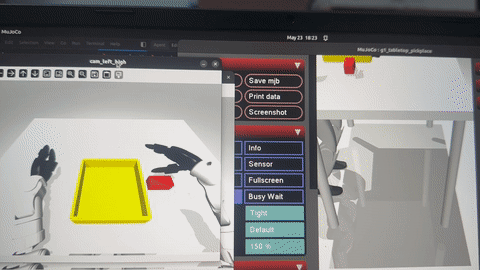
    </td>
    <td align="center" width="32%">
      <strong>Trial 2</strong><br>
      <a href="./assets/videos/eval-2.mp4">Watch video</a><br>
      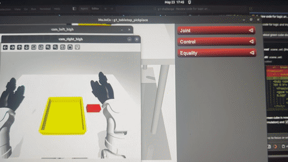
    </td>
    <td align="center" width="32%">
      <strong>Trial 3</strong><br>
      <a href="./assets/videos/eval-3.mp4">Watch video</a><br>
      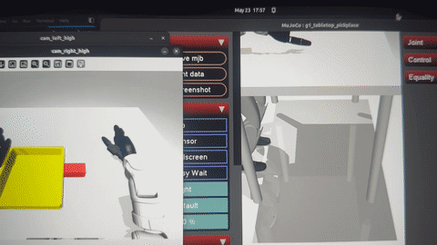
    </td>
  </tr>
  <tr>
    <td align="center" width="32%">
      <strong>Trial 4</strong><br>
      <a href="./assets/videos/eval-4.mp4">Watch video</a><br>
      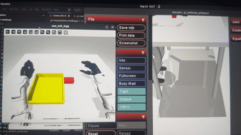
    </td>
    <td align="center" width="32%">
      <strong>Trial 5</strong><br>
      <a href="./assets/videos/eval-5.mp4">Watch video</a><br>
      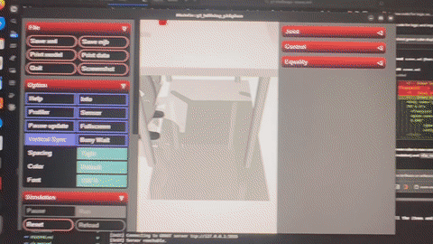
    </td>
    <td align="center" width="32%">
      <strong>Trial 6</strong><br>
      <a href="./assets/videos/eval-6.mp4">Watch video</a><br>
      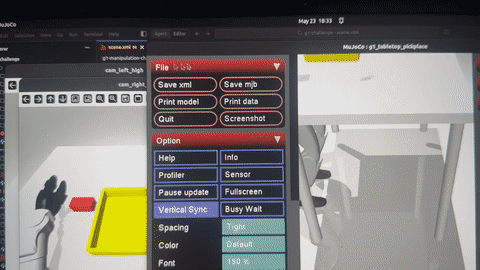
    </td>
  </tr>
</table>

### Conclusion

The model achieves **3/6 full task success**, demonstrating a functional pick-and-place policy within its training distribution. Clear boundaries remain:

- **Works**: right-side targets within the familiar reach envelope
- **Fails**: targets outside the reach envelope (trial 5), left-side targets requiring a left-hand lead (trial 6), and close-range grasps where wrist-camera feedback is needed (trial 1)

The remaining failures are dataset-level gaps — reach coverage, center-region pickups, and hand-assignment diversity — not model architecture issues.

---

## What I'd Do Next

1. **Add wrist cameras** (`cam_left_wrist`, `cam_right_wrist`) to the modality config — trial 1 confirms that high cameras alone are not enough for reliable close-range grasping. The final centimeters of approach need fine-grained visual feedback that only wrist-mounted cameras can provide.
2. **Expand reach coverage in the dataset** — trial 5 failed because x = −0.25 is outside the training distribution. Adding demonstrations (real or teleoperated sim) with objects at full arm extension would close this gap.
3. **Add left-hand-first demonstrations** — all 210 real-robot episodes are right-hand-first. Trial 6 shows the model cannot adapt when the target is on the left side. A targeted batch of left-hand-lead episodes would directly fix this bias.
4. **Aggregate data from multiple public pick-and-place sources** — rather than collecting new demonstrations manually, source additional datasets covering diverse object positions, hand assignments, and reach ranges, then merge and normalize them to give the model broader coverage of the cases that currently fail.

---

## Code Structure

```
vla-test-v/
├── g1-pick-and-place/                                       # Simulation + inference
│   ├── ★ vla_run.py                                        # Closed-loop VLA inference — ZMQ client, obs saving
│   ├── ★ teleoperate.py                                    # Full joint teleoperation + episode recording (keyboard + gamepad)
│   ├── main.py                                              # Interactive MuJoCo viewer / manual joint control
│   ├── scene.xml                                            # Modified scene: single table, red cube, yellow box
│   └── g1.xml                                               # G1 robot MJCF (28 DOF: 7+7 arm + 7+7 Dex3 hand)
│
└── gr00t-unitree-g1/                                        # GR00T N1.7 — NVIDIA (submodule)
    ├── scripts/
    │   ├── ★ lerobot_conversion/convert_v3_to_v2.py        # Dataset format conversion (LeRobot v3 → v2)
    │   ├── ★ recolor_blue_to_yellow.py                     # HSV hue rotation — visual domain adaptation
    │   └── split_dataset.py                                 # Train / test split (90 / 10)
    ├── examples/
    │   ├── ★ finetune.sh                                   # LoRA fine-tuning launcher — wraps launch_finetune.py
    │   └── G1_Dex3/g1_dex3_config.py                       # G1 embodiment config (cameras, action/state mapping)
    └── gr00t/
        ├── ★ experiment/launch_finetune.py                 # Core fine-tuning entry point (invoked by finetune.sh)
        ├── ★ eval/run_gr00t_server.py                      # ZMQ policy server — inference endpoint (cloud GPU)
        ├── eval/open_loop_eval.py                           # Held-out test set evaluation (trajectory plots)
        └── policy/server_client.py                          # ZMQ client protocol
```

> **★ marks the files the challenge deliverables map to:**
> - `dataset/` → `lerobot_conversion/convert_v3_to_v2.py`, `recolor_blue_to_yellow.py`, `split_dataset.py`
> - `train/` → `finetune.sh` → `experiment/launch_finetune.py`, `G1_Dex3/g1_dex3_config.py`
> - `inference/` → `vla_run.py` (sim client), `run_gr00t_server.py` (policy server)

### Quick Start

```bash
# Clone with submodule
git clone --recurse-submodules <repo-url>
cd g1-pick-and-place
uv sync

# Explore the MuJoCo scene interactively (no GPU needed)
uv run python main.py
```

For the full setup, fine-tuning, and inference workflow, see the dedicated READMEs in each component:

- **[`g1-pick-and-place/README.md`](https://github.com/hieultph/g1-pick-and-place/blob/main/README.md)** — MuJoCo simulation setup, scene configuration, closed-loop VLA inference (`vla_run.py`), teleoperation (`teleoperate.py`), grip-assist mechanics, and Hz monitoring
- **[`gr00t-unitree-g1/README.md`](https://github.com/hieultph/gr00t-unitree-g1/blob/main/README.md)** — GR00T N1.7 installation, dataset preprocessing, LoRA fine-tuning (`launch_finetune.py`), policy server (`run_gr00t_server.py`), open-loop evaluation, and TensorRT deployment

---

## Action Tokenization: Handling G1's 28 DOF

The G1 with Dex3 hands has one of the most complex action spaces among humanoid robots.

### Joint Layout

```
Action vector (28D):
┌──────────────────┬──────────────────┬──────────────────┬──────────────────┐
│  left_arm[0:7]   │ right_arm[7:14]  │ left_hand[14:21] │right_hand[21:28] │
│                  │                  │                  │                  │
│  shoulder_pitch  │  shoulder_pitch  │  thumb_0         │  thumb_0         │
│  shoulder_roll   │  shoulder_roll   │  thumb_1         │  thumb_1         │
│  shoulder_yaw    │  shoulder_yaw    │  thumb_2         │  thumb_2         │
│  elbow           │  elbow           │  index_0         │  index_0         │
│  wrist_roll      │  wrist_roll      │  index_1         │  index_1         │
│  wrist_pitch     │  wrist_pitch     │  middle_0        │  middle_0        │
│  wrist_yaw       │  wrist_yaw       │  middle_1        │  middle_1        │
└──────────────────┴──────────────────┴──────────────────┴──────────────────┘
```

GR00T's output is applied **directly to `data.ctrl`** as joint position targets — no intermediate policy layers or IK solver. The robot is stationary (pelvis fixed), so the full 28 DOF budget is available for bimanual arm + dexterous hand control.

### Continuous Diffusion Head vs. Discrete Tokens

GR00T N1.7 uses a **flow-matching diffusion head** that produces continuous joint position targets in an **action chunk of 16 timesteps**. This matters significantly for dexterous manipulation:

- **Discrete tokenization** (OpenVLA): each DOF bucketed into 256 bins. For a finger joint with ±1.5 rad range, that's ~12 ms precision per bin — often not enough to distinguish a firm grasp from a missed one.
- **Continuous diffusion** (GR00T): smooth trajectories, no quantization loss, temporal coherence across the 16-step chunk. The model produces gradual finger closure rather than sudden jumps — important for not knocking objects away on contact.

### Joint Positions vs. EEF Delta

| | Joint positions (used) | EEF delta + IK |
|--|--|--|
| Matches dataset format | ✅ | ❌ Requires re-labeling |
| No IK solver | ✅ | ❌ Adds failure modes |
| Works for 3-finger Dex3 hand | ✅ Direct | ❌ No clean EEF definition for 3-finger hand |
| Spatial generalization | ⚠️ Less intuitive in joint space | ✅ Cartesian more transferable |

For a 5-day sprint with a 28-DOF dexterous hand, joint positions were the practical choice. The dataset is labeled in joint space, GR00T's `REAL_G1` embodiment expects joint space, and there is no well-defined EEF for the Dex3 hand. Latent EEF representations are worth exploring as future work.

---

## Data Augmentation

### Techniques considered but not applied

A standard augmentation toolkit for this kind of real-to-sim VLA training would include:

| Category | Technique | Purpose |
|----------|-----------|---------|
| Visual | Random crop / resize | Robustness to camera FOV shift |
| Visual | Brightness / contrast jitter | Lighting invariance |
| Visual | Gaussian blur, noise injection | Sensor noise robustness |
| Visual | Random horizontal flip | Scene symmetry (with care for handedness) |
| Spatial | Object position jitter | Generalization beyond fixed placement |
| Spatial | Synthetic demo mixing | Coverage of edge-case grasp angles |
| Lingual | Paraphrase expansion (LLM-generated) | Instruction diversity |

These were intentionally skipped for two reasons:

1. **The real dataset is already high quality.** 210 episodes of genuine G1 Dex3 manipulation with natural lighting variation, real contact dynamics, and diverse object placement cover the training distribution well. Synthetic augmentation on top of real data risks introducing artifacts that hurt rather than help.

2. **Pipeline correctness first.** The priority for this sprint was to validate the full loop — data conversion → fine-tuning → ZMQ inference → sim execution — before tuning any knobs. Augmentation is an optimization step; applying it before the baseline works makes it impossible to attribute improvements or regressions to the right cause.

The only augmentation actually applied was the HSV hue rotation, which was a **necessity** (not an optimization) to bridge the real-dataset blue container to the sim's yellow target.

### Applied augmentation

#### Visual
- **Color domain shift**: The physical container in the real-robot dataset is **blue**. Applied HSV hue rotation to shift blue pixels to yellow across all video frames — bridging visual domain from real dataset to sim environment.

**Before/after HSV hue rotation:** Left frame shows the original blue container from the real-robot dataset; right frame shows the same frame after shifting blue pixels to yellow, matching the MuJoCo simulation target.

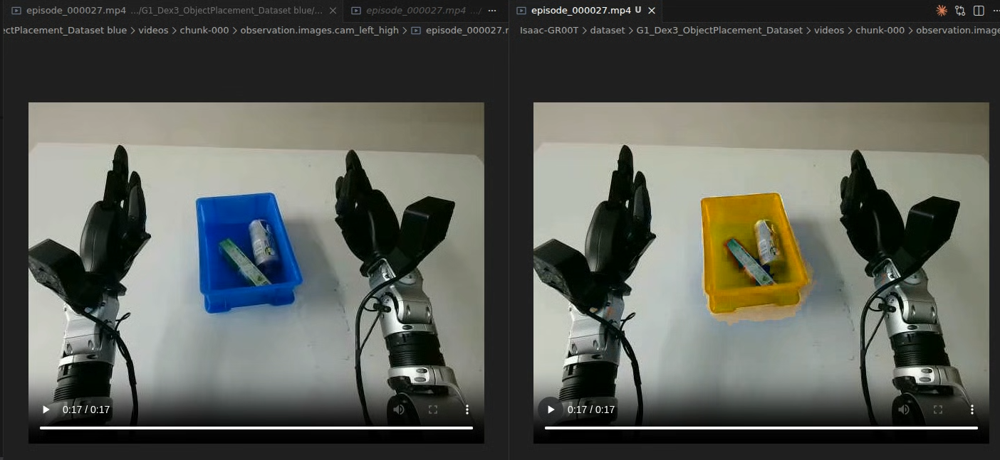

- **Natural illumination variation**: Real-world capture inherently covers varying lighting conditions (no synthetic augmentation needed).

#### Lingual
- **Language relabeling**: Replaced the generic annotation `"object_placement"` with `"pick up all the items and put them in the yellow box"` and paraphrases ("place all objects into the yellow container", "grab the items and drop them in the yellow box").

#### Spatial
- Natural episode variation across 210 real-robot demonstrations covers diverse object placement positions — more effective than synthetic randomization on scripted demos.

---

## System Architecture

**End-to-end inference pipeline:** Local MuJoCo simulation renders stereo camera frames, packages them with proprioception and language via ZMQ, and sends them through a CloudFlare tunnel to the GR00T N1.7 policy server running on a cloud GPU.

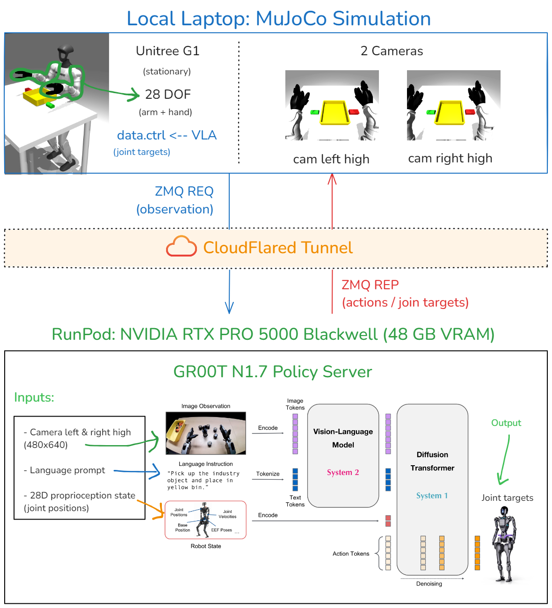


**Control loop**: Each iteration the client renders two camera frames, packages them with the current 28D joint state and language prompt, sends to the server, receives a 16-step action chunk, and writes joint positions directly to `data.ctrl`. The robot is fixed in place — no balance policy needed, the full action budget goes to arm and hand.

**Observation debugging**: Built `--save-obs-dir` that dumps every server request as `.npz` + `.json` + `.png`. This was critical for verifying what the model actually sees at inference time.

---

## Research: Model and Simulator Decisions

### Why GR00T N1.7 (not OpenVLA or Octo)

Before writing any training code I compared the three main open-source VLAs against this task's constraints:

| Criteria | **GR00T N1.7** | OpenVLA | Octo |
|----------|:-:|:-:|:-:|
| Native Unitree G1 embodiment | ✅ `UNITREE_G1` tag | ❌ | ❌ |
| Humanoid + bimanual design | ✅ | ⚠️ General | ⚠️ General |
| Data format | ✅ LeRobot v2 | ❌ RLDS | ⚠️ RLDS / JAX |
| Fine-tuning API | ✅ Single-command LoRA | ⚠️ Complex | ⚠️ Manual |
| Action prediction | ✅ Continuous diffusion | ⚠️ 256-bin discrete | ⚠️ Older arch |
| VRAM (inference) | ✅ ~16 GB+ | ❌ ~27 GB+ | ⚠️ Moderate |
| License | ✅ Apache 2.0 | ✅ MIT | ✅ MIT |

GR00T is the only model with native G1 embodiment, meaning the pretrained weight distribution already encodes G1 kinematics and scale — fine-tuning converges faster and requires fewer demonstrations than adapting a general-purpose backbone.

### Why MuJoCo (not Isaac Lab)

I ran both and measured:

| Simulator | FPS on my laptop | Decision |
|-----------|:----------------:|----------|
| **MuJoCo** | ~40 | Used — stable, headless-capable, full CPU physics |
| Isaac Lab | ~10 | Dropped — officially needs RTX 3080+ / 8 GB VRAM; unusable at 10 FPS |

Isaac Lab has a [beautiful built-in G1 pick-and-place environment](./assets/images/g1-isaac-sim.png) — I would have used it if the hardware allowed. At 10 FPS the viewer was too laggy to interact with meaningfully. MuJoCo gave 40+ FPS on CPU.

**Side-by-side simulator comparison:** Isaac Lab (left) renders the official Unitree G1 pick-and-place environment with rich visuals but ran at ~10 FPS on the local RTX 3050. MuJoCo (right) provides a lightweight CPU-only view that sustained ~40 FPS — the deciding factor for interactive development.

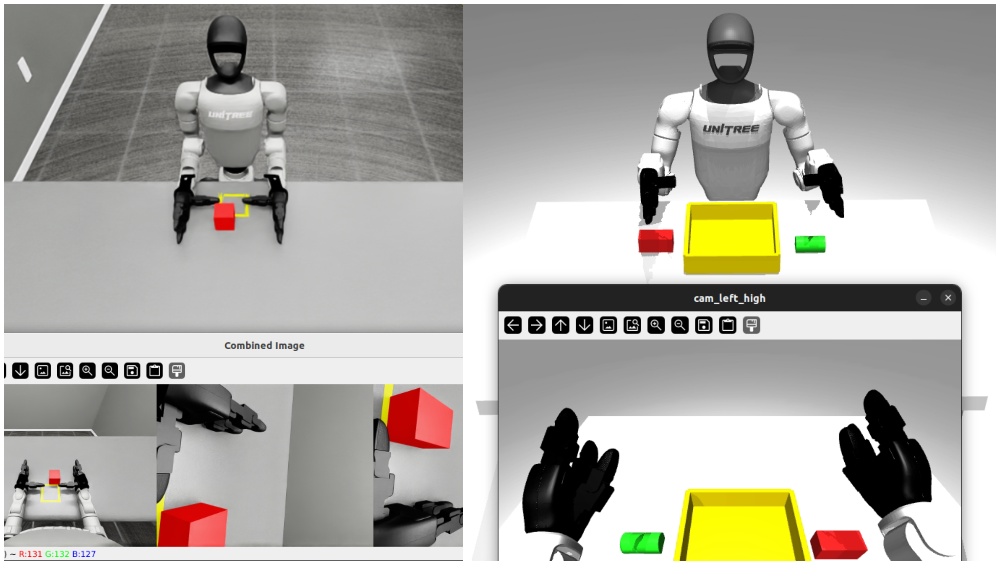

---

## Dataset

### Strategy: Real-World Data over Synthetic Demos

| Approach | Feasibility | Data quality | Decision |
|----------|:-:|:-:|----------|
| VR teleoperation ([Unitree XR](https://github.com/unitreerobotics/xr_teleoperate)) | ❌ No VR headset | High | Skipped |
| Scripted MuJoCo demos | ✅ Free | Low — scripted motion lacks dexterity variation | Skipped |
| **Real Unitree G1 Dex3 dataset (HuggingFace)** | ✅ Free download | High — real robot, natural variation | **Used** |

Training on real robot data eliminates the sim-to-real gap in the training signal. GR00T's backbone already knows G1 kinematics — fine-tuning on real data teaches the manipulation task without fighting distribution shift in the dynamics.

### Dataset: [Unitree G1 Dex3 ObjectPlacement](https://huggingface.co/datasets/unitreerobotics/G1_Dex3_ObjectPlacement_Dataset)

| Property | Value |
|----------|-------|
| Episodes | 210 |
| Total frames | 98,266 |
| Frame rate | 30 fps |
| Action / state space | 28D joint positions |
| Cameras | `cam_left_high`, `cam_right_high`, `cam_left_wrist`, `cam_right_wrist` |
| Video resolution | 480 × 640 |
| Original language annotation | `"object_placement"` |
| Train / test split (after preprocessing) | 180 / 30 episodes, split manually |

### Preprocessing Pipeline

**1. Format conversion** — Dataset is LeRobot v3; GR00T N1.7 requires LeRobot v2. Used `Isaac-GR00T/scripts/lerobot_conversion/convert_v3_to_v2.py`.

**2. Visual domain adaptation** — HSV hue rotation to shift the blue container to yellow, matching the MuJoCo scene.

**3. Language relabeling** — Replaced `"object_placement"` with `"pick up all the items and put them in the yellow box"`.

**4. Sim-to-dataset alignment** — Extracted the initial joint configuration from a real episode, injected it into MuJoCo, then manually tuned the `head_cam` FOV and position to match the dataset's first training frame. This ensures what the model sees at inference closely matches the training distribution.

**Visual domain alignment:** Left is a frame from the real-robot dataset; right is the MuJoCo scene after manually tuning head-cam FOV, position, and object placement to match the dataset's first training frame.

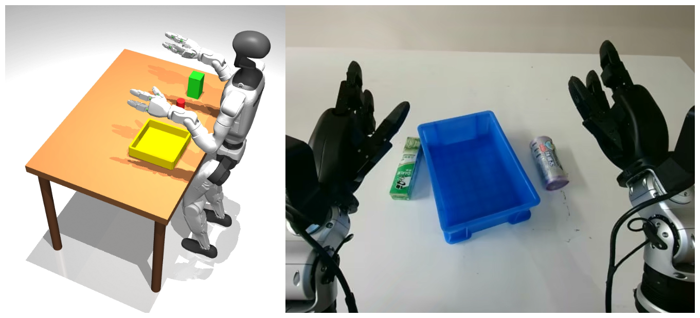

**5. Pose validation** — Verified all 28 DOF values from the real robot dataset were within the joint limits defined in `g1.xml`.

**6. Train / test split** — Manually split the 210 episodes into 180 train / 30 test using `split_dataset.py`. The original HuggingFace dataset does not include a pre-defined split.

---

## Training

### Configuration

| Parameter | Value |
|-----------|-------|
| Base model | GR00T N1.7 — `REAL_G1` embodiment |
| Fine-tuning method | LoRA |
| Cameras used | `cam_left_high`, `cam_right_high` |
| Input resolution | 224 × 224 |
| Max steps | 2,000 → extended to 6,000 |
| Global batch size | 64 |
| Learning rate | 1e-4 |
| Weight decay | 1e-5 |
| Episode sampling rate | 0.5 |
| Action horizon | 16 steps |
| Dataloader workers | 8 |

### Infrastructure

| Task | Hardware | Cost |
|------|----------|------|
| Data preprocessing, conversion, scene alignment | Local laptop — RTX 3050 6 GB, 16 GB RAM, Ubuntu 22.04 | Free |
| Fine-tuning + inference | RunPod — NVIDIA RTX PRO 5000 Blackwell, 48 GB VRAM | ~$8–12 |

### Training Curves (W&B)

**Training loss (first 2,000 steps):** Diffusion loss and flow-matching loss both decrease monotonically, indicating the LoRA adapter is learning the task distribution without divergence.

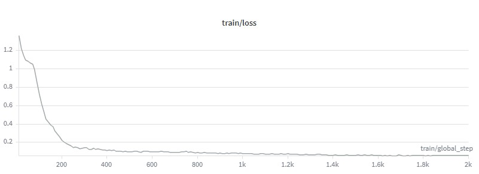

**Training loss (extended to 6,000 steps):** Loss continues to trend downward. The extended run confirms the earlier trend is stable rather than lucky early convergence.

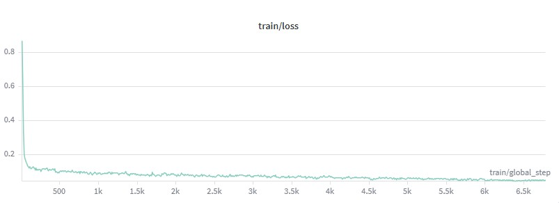

**Gradient norm:** Gradient norms stay within a healthy range throughout training.

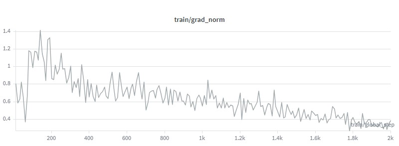

The 2k-step run showed clearly decreasing loss. Extended to 6k steps and monitored gradient norms to check for overfitting on the 210-episode dataset.

### Optimizer Note

Switched from AdamW to `adam_torch_fused` — PyTorch's fused CUDA implementation that uses Blackwell-specific kernel optimizations. Measured **~15% faster training throughput** on the RTX PRO 5000.

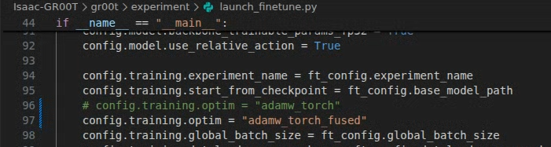

---

## Evaluation Details

### Open-Loop Evaluation on Held-Out Test Set

Training is **okay but not good**. The model has learned the rough structure of the task — arm motion follows the right direction and general phasing — but the predicted trajectories (orange) are noticeably unstable compared to ground truth (blue): the lines oscillate, drift, and deviate rather than tracking smoothly. The model has not converged to precise, stable imitation.

**Open-loop trajectory comparison — Sample 0:** Predicted (orange) vs. ground-truth (blue) joint trajectories.

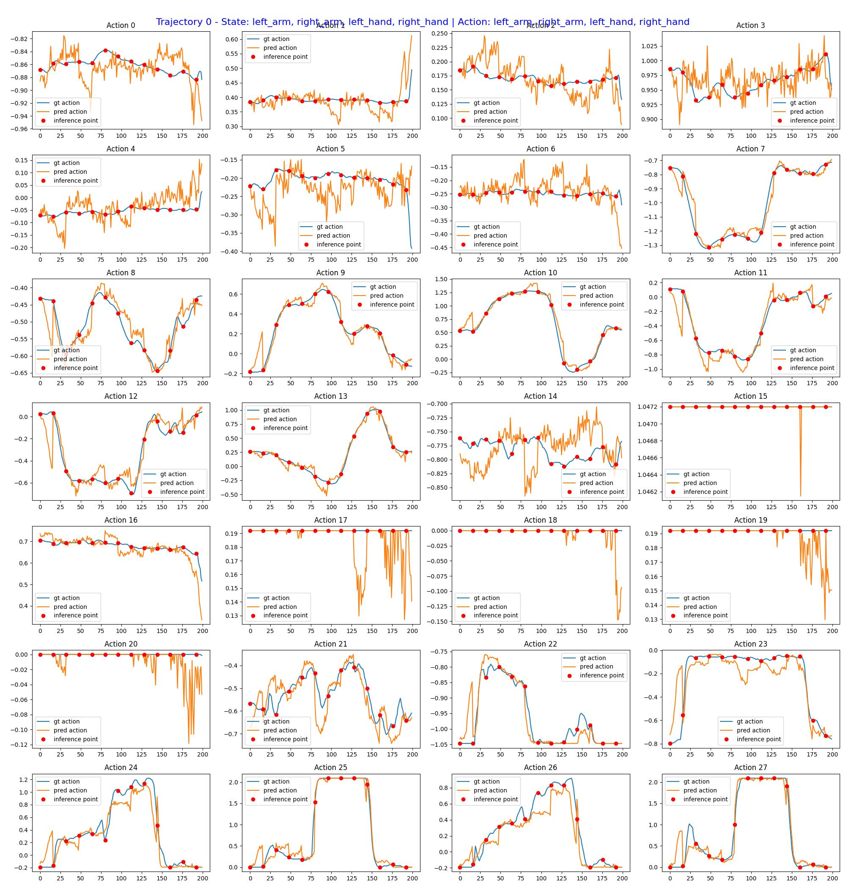

**Open-loop trajectory comparison — Sample 1:** Predicted (orange) vs. ground-truth (blue) joint trajectories.

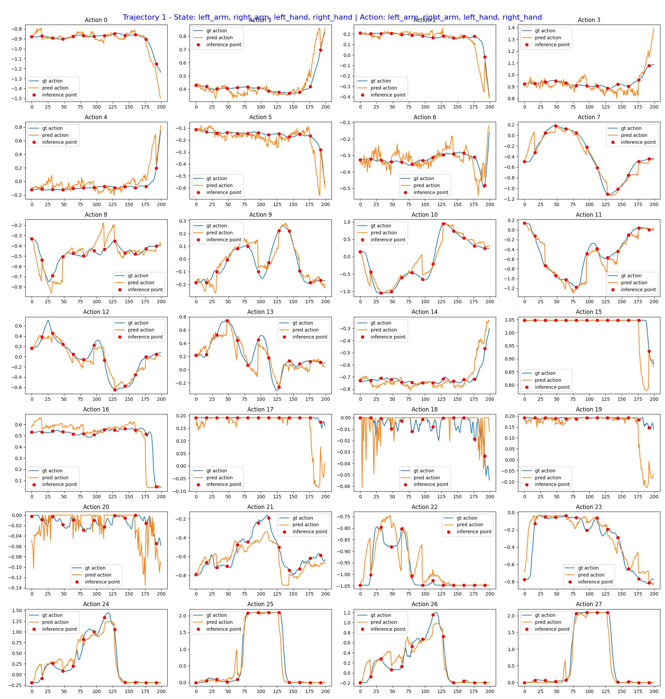

**Open-loop trajectory comparison — Sample 2:** Predicted (orange) vs. ground-truth (blue) joint trajectories.

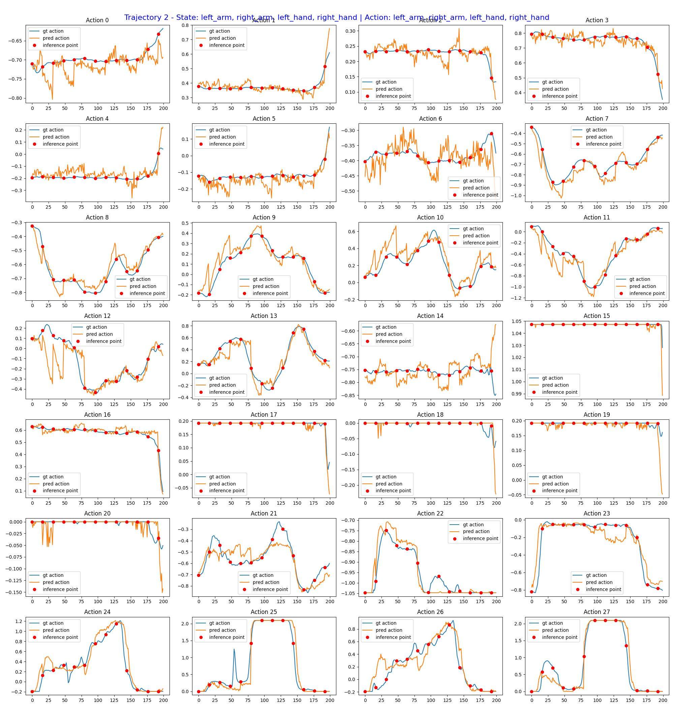

**Open-loop trajectory comparison — Sample 3:** Predicted (orange) vs. ground-truth (blue) joint trajectories.

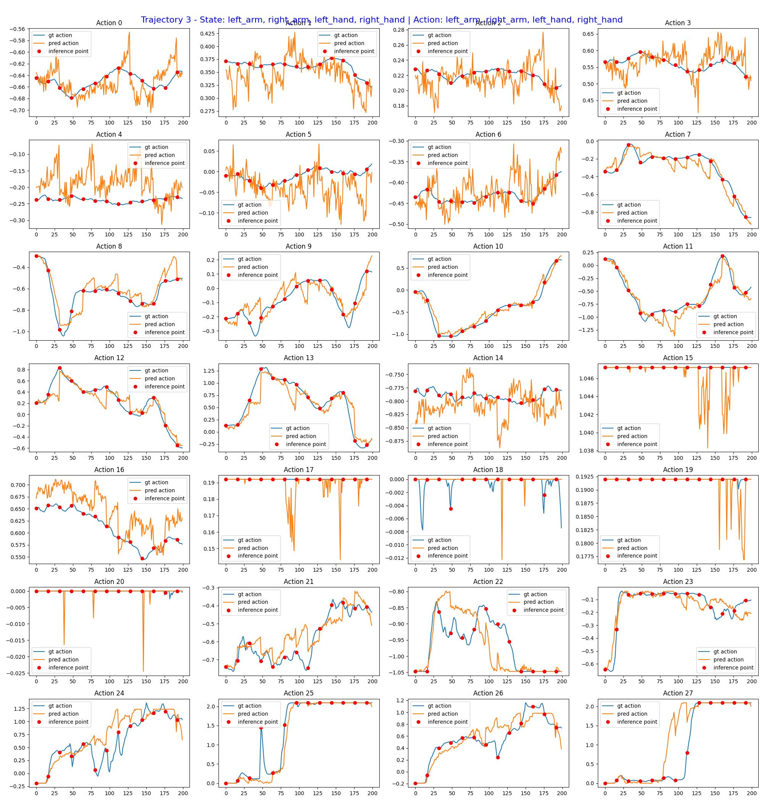

**Open-loop trajectory comparison — Sample 4:** Predicted (orange) vs. ground-truth (blue) joint trajectories.

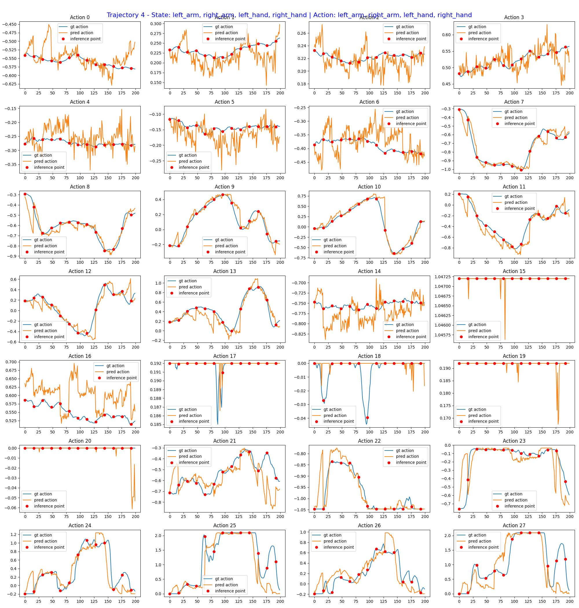

> **Pattern summary across 30 held-out episodes:** The model consistently predicts reasonable arm trajectories, but gripper closure is systematically triggered earlier than the ground truth. This timing bias was the first signal pointing to the data bug below.

### Root Cause Analysis — Data Bug

> **Status: Fixed.** The timestamp misalignment described below has been patched in the conversion script. This section documents the bug for reference — if you reproduce training from scratch and see early-gripper bias, this is the likely cause.

During post-training debugging I found a **critical timestamp misalignment in the v3→v2 conversion script**.

Evidence found by comparing episode parquet and video files:

| Episode | Parquet action timestamps end at | Video duration |
|---------|:--------------------------------:|:--------------:|
| Episode 2 | 17.6 s | 22.0 s |
| Episode 3 | 17.6 s | 22.0 s |
| Consistent across multiple episodes | | |

**Timestamp mismatch evidence:** Parquet action rows end at 17.6 s while the corresponding video file runs to 22.0 s. The video is ~4.4 s longer than the actual timestamp recorded in the parquet file.

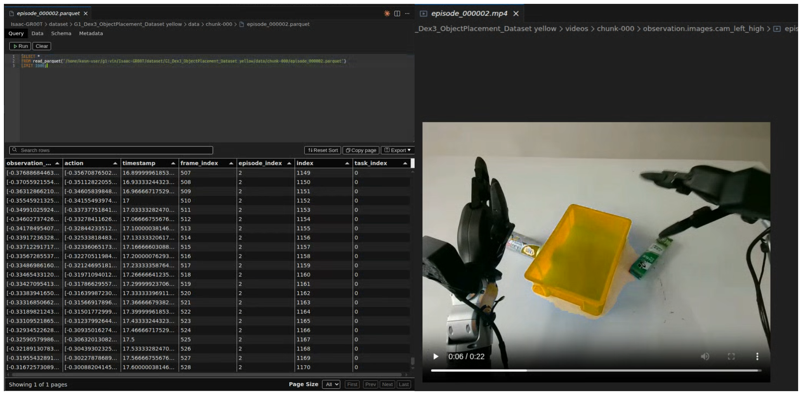

The conversion script incorrectly **cut a segment from the previous episode's video and attached it to the current episode's video**. This caused the video to be longer than its own action stream in the parquet. Because the video contained extra frames from a prior episode, the **action labels were offset relative to the current video frames** — the model learned to close the gripper before the hand had actually reached the target object in the current episode. This explains the "manipulation without seeing the object" bias seen in both open-loop evaluation and closed-loop trials.

The fix is to align timestamps at conversion time so action rows and video frames stay in sync. If you re-run the conversion pipeline without the patch and observe systematic early-gripper behavior in open-loop evaluation, check the parquet/video timestamp discrepancy first.

---

## References

**Models**

1. **GR00T N1** — NVIDIA, *Isaac GR00T N1: An Open Foundation Model for Generalist Humanoid Robots*, 2025. [[GitHub]](https://github.com/NVIDIA/Isaac-GR00T)
2. **Octo** — Octo Model Team, *Octo: An Open-Source Generalist Robot Policy*, arXiv:2405.12213, 2024. [[Website]](https://octo-models.github.io/) [[GitHub / Fine-tune]](https://github.com/octo-models/octo)
3. **OpenVLA** — Kim et al., *OpenVLA: An Open-Source Vision-Language-Action Model*, arXiv:2406.09246, 2024. [[GitHub]](https://github.com/openvla/openvla)
4. **OpenVLA-OFT** — *OpenVLA-OFT: Efficient Fine-Tuning of OpenVLA*, 2025. [[Website]](https://openvla-oft.github.io/) [[arXiv 1]](https://arxiv.org/html/2512.11921v1) [[arXiv 2]](https://arxiv.org/html/2603.16044v1)
5. **Diffusion Policy** — Chi et al., *Diffusion Policy: Visuomotor Policy Learning via Action Diffusion*, arXiv:2303.04137, RSS 2023.
6. **RT-2** — Brohan et al., *RT-2: Vision-Language-Action Models Transfer Web Knowledge to Robotic Control*, arXiv:2307.15818, CoRL 2023.
7. **Psi0** — Physical Superintelligence Lab, *Psi0: Open-Source Robot Policy*, 2025. [[GitHub]](https://github.com/physical-superintelligence-lab/Psi0)

**Unitree G1 Hardware & Simulation**

8. **Unitree G1 Developer Guide** — Unitree Robotics, *G1 Developer Documentation*, 2025. [[Docs]](https://support.unitree.com/home/zh/G1_developer/about_G1) [[Remote Control]](https://marketing.unitree.com/article/zh/G1/Remote_Control.html)
9. **Unitree G1 Joint Mapping (CSDN)** — Community reference for G1 joint layout and control interface, 2025. [[Article]](https://blog.csdn.net/qq_28912651/article/details/149045107)
10. **Unitree XR Teleoperate** — Unitree Robotics, *XR Teleoperate for G1 data collection*, 2025. [[GitHub]](https://github.com/unitreerobotics/xr_teleoperate)
11. **Unitree Isaac Lab** — Unitree Robotics, *Unitree Sim IsaacLab*, 2025. [[GitHub]](https://github.com/unitreerobotics/unitree_sim_isaaclab)

**Dataset & Data Pipeline**

12. **Unitree G1 Dex3 Dataset** — Unitree Robotics, *G1 Dex3 Object Placement Dataset*, 2025. [[HuggingFace]](https://huggingface.co/datasets/unitreerobotics/G1_Dex3_ObjectPlacement_Dataset)
13. **RLDS Dataset Builder** — Pertsch et al., *RLDS Dataset Builder — converting datasets to RLDS format*, 2023. [[GitHub]](https://github.com/kpertsch/rlds_dataset_builder)

**Community & Blogs**

14. **Open-Weight Robot Models Overview** — RoboCloud, 2025. [[Blog]](https://robocloud-dashboard.vercel.app/learn/blog/open-weight-robot-models)
15. **G1 Pick-and-Place Implementation Notes (CSDN)** — Community walkthrough of G1 manipulation setup, 2024. [[Article]](https://blog.csdn.net/qq_41204464/article/details/159830799)

---
